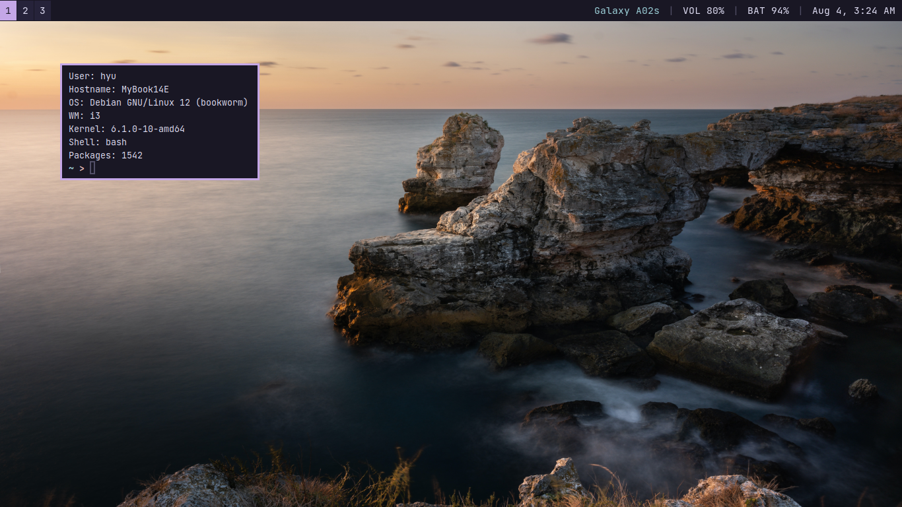
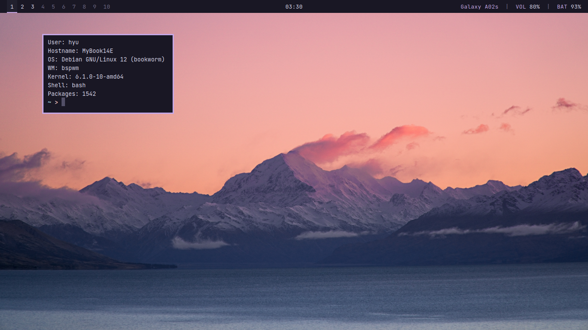
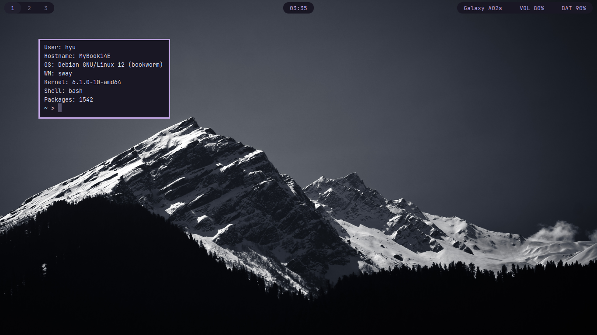

# Dotfiles

i3, bspwm, Sway, and many other software configurations and scripts for my desktop.

I try to avoid using Nerd Fonts or any other font icons, so there are no icons
included on all of my configuration.

All setup and installer scripts are available in [setup](setup/) directory.

You can find a list of wallpaper that I liked in
[screenshots/wallpapers.md](screenshots/wallpapers.md).

## Screenshots

### i3 + i3status

My first tiling window manager, because it's well documented for new user.

### bspwm + Polybar

I like how bspwm have dynamic tiling and monocle layout.

### Sway + Waybar

I'm glad that there is an _i3-like_ for Wayland. It's my main window
manager by now, just because it's smoother and simpler than X11.

## Systems

- Distribution: Debian Bookworm
- Shell: Bash
- Init system: systemd
- Window manager: i3, bspwm, and Sway
- Status bar: i3status, i3blocks, Polybar, swaybar, and Waybar
- Multimedia server: PipeWire
- Notification daemon: Dunst (X11) and Mako (Wayland)
- Screen locker: i3lock (X11) and swaylock (Wayland)
- Backlight controller: light

## Software

- Terminal emulator: Alacritty
- Application launcher: Rofi (X11) and Fuzzel (Wayland)
- Text editor: Neovim
- File manager: lf
- Image viewer: nsxiv (X11) and swayimg (Wayland)
- Screenshoter: Maim (X11) and Grimshot (Wayland)

## Notes

- Different distribution have different packages name.
- View the scripts and configurations first before using it.
- Change the configurations according to your hardware and applications that
  you need.
- If you want to start X manually using `startx`, modify the
  [~/.config/X11/xsession](.config/X11/xsession) file and add `xinput`
  configuration before execute the window manager.

## Tips

For more details about my set up and some packages that I used, you can read
my post:
[My Debian Setup](https://wahyuwiyoko.github.io/blog/linux/my-debian-setup-with-i3wm/).

I also had an article
[how to enable touchpad tap-to-click](https://wahyuwiyoko.github.io/blog/linux/enable-touchpad-tap-to-click/)
if you are curios how to enable it.

## Special Thanks

- [Addy](https://github.com/addy-dclxvi)
- [Derek Taylor](https://gitlab.com/dwt1)
- [drewgrif](https://github.com/drewgrif)
- [Eric Murphy](https://github.com/ericmurphyxyz)
- [Ilham](https://github.com/ilhamisbored)
- [Alex Booker](https://github.com/bookercodes)
- [Rosé Pine](https://rosepinetheme.com/)
